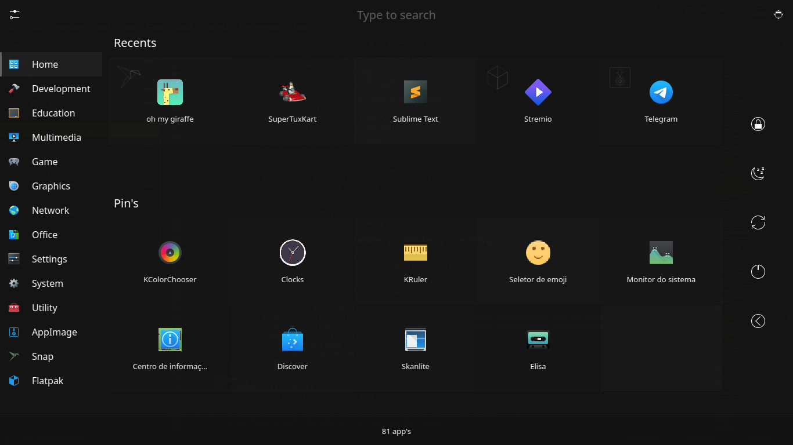
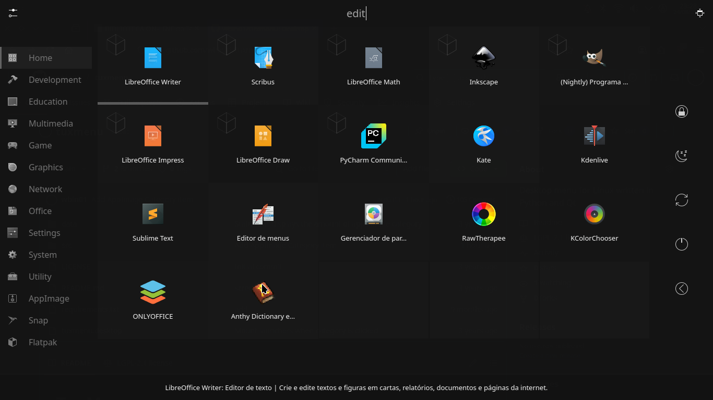

# TuxMenu

Desktop menu for Linux written in Python and Qt.

Is not ready (TODO: Integration with Gtk themes, and D-bus Power Management).

#### Screens

Menu home page

Context menu: Pin and unpin apps; Desktop shortcut.

Type to search

